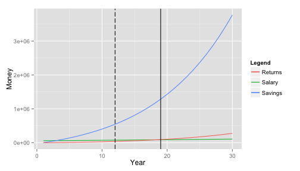

## What is financial independence

* Financial independence is generally used to describe the state of having sufficient personal wealth to live, without having to work actively for basic necessities. [[`Wikipedia`](https://en.wikipedia.org/wiki/Financial_independence)]


* It means you earn more from your assets (investments) than you need to spend.

* Though it helps, you don't have to get a huge salary to become financially independent.


* For instance, if Bob need to spend 1000$ each month, and receive 1100$ each month from his investments, he is financially independent. If Steve spends 200,000$ each month but receive 100,000 from his investments, he is not financially independent.

--- .class #id 

## Why achieve financial independence

There can be many reasons:

* Freedom: you don't have to work anymore in order to live. Once you achieve financial independence, you can keep working, but you can also start a business, follow your passions, or go into an indefinite vacations...

* Security: if anything should happen, you have a solid safety net that will prevent you or you family to end up in the street.

* Retirement: of course, this is an obvious objective.

* Confidence and personal satisfaction: by knowing that you have a solid safety net and achieved a difficult objective.

--- .class #id 

## How to achieve it?

You can change many parameters:

* Spend less and save: saving is a crucial if you want to achieve financial independence. It can mean living in a smaller house than you can afford to for instance. For some people it can be difficult, but you generally don't notice it after a while.

* Earn more and save: if you can't spend less, you need to get an alternate source of income. You can start a small business or work additional hours if necessary.

* Invest: Investing your saved money is important if you want to receive earnings from it. Many different solutions (such as bonds or stocks) exist.

--- .class #id 
## An example


If someone with a 60000$ per year salary and no initial savings saves 50% of his/her salary and invest it into a 8% per year investment (S&P500 is around 11%), then he/she will achieve financial independence in 12 years.
Of course, such an investment would have some variance; try my application to get a more detailed simulation ;).

```r
print(simulation_plot(input))
```


